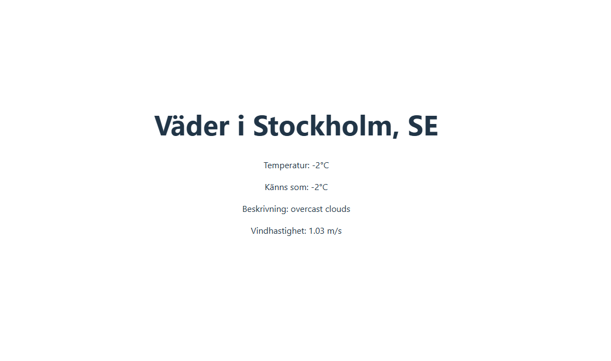

# ☁️ WeatherApp (React & TypeScript)

En enkel väderapplikation byggd med React och TypeScript som hämtar väderdata från OpenWeatherMap API.

## ✨ Funktioner

* Sök väder per stad.
* Visar aktuell temperatur, upplevd temperatur, väderbeskrivning och vindhastighet.
* Laddnings- och felhantering.

## 📸 Skärmdump

